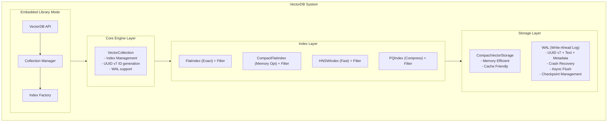
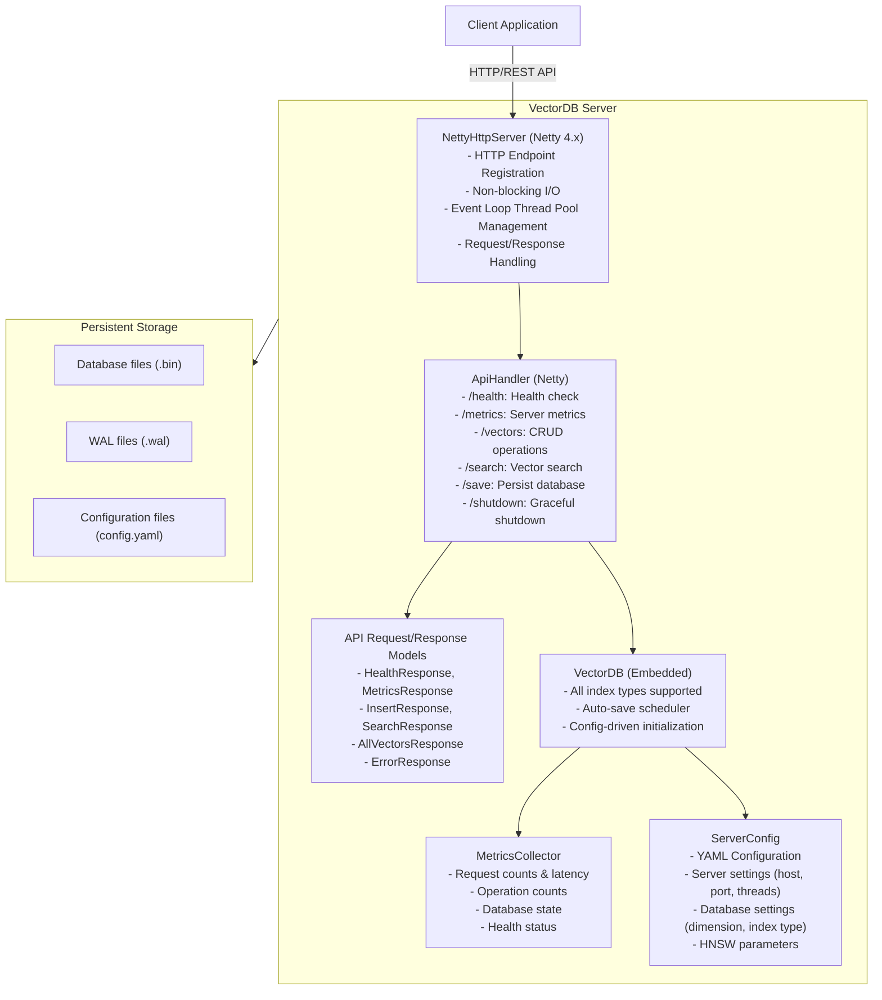
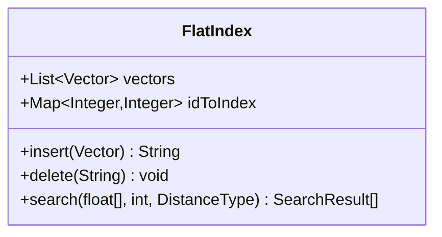
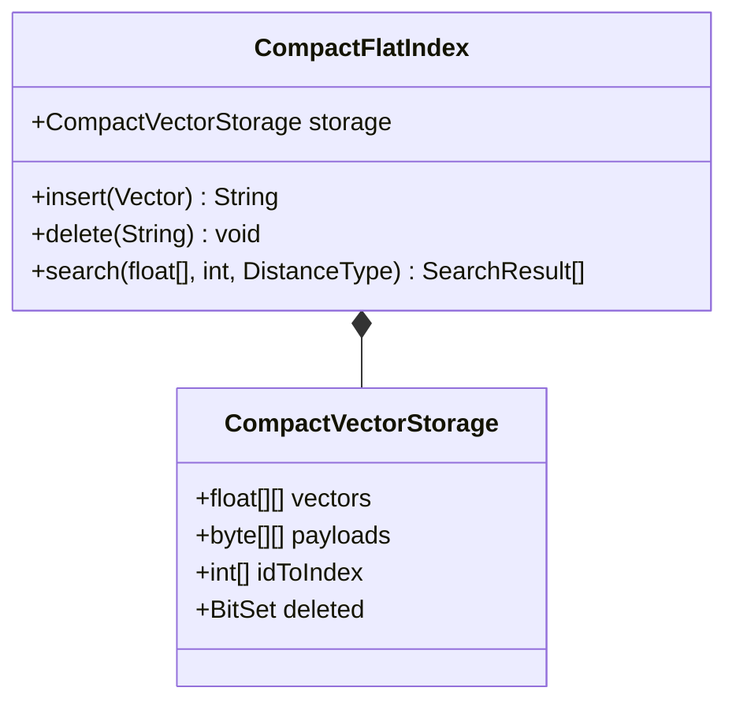
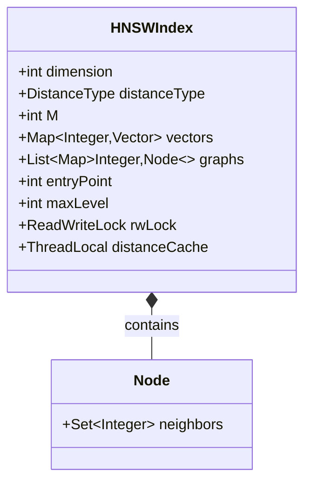
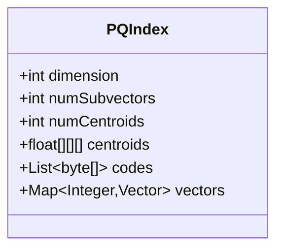
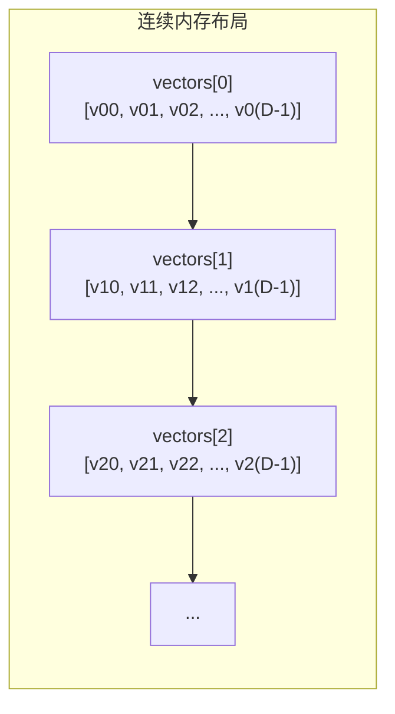

# 向量数据库设计文档

## 1. 系统架构

### 1.1 整体架构



### 1.2 服务器模式架构



## 2. 服务器模式详细设计

### 2.1 RESTful API 规范

| 端点                   | 方法     | 功能       | 请求体  | 响应     |
|----------------------|--------|----------|------|--------|
| `/`, `/vectors.html` | GET    | 向量管理页面   | -    | HTML界面 |
| `/health`            | GET    | 健康检查     | -    | 健康状态   |
| `/metrics`           | GET    | 服务器指标    | -    | 指标JSON |
| `/vectors`           | GET    | 向量列表信息   | -    | 统计信息   |
| `/vectors/all`       | GET    | 获取所有向量详情 | -    | 向量详情列表 |
| `/vectors`           | POST   | 插入向量     | 向量数据 | 插入结果   |
| `/vectors`           | DELETE | 删除向量     | ID列表 | 删除结果   |
| `/search`            | POST   | 向量搜索     | 查询参数 | 搜索结果   |

### 2.2 配置管理

**YAML 配置文件结构:**

```yaml
server:
  host: string      # 绑定地址
  port: int         # 端口号
  threads: int      # 工作线程数

database:
  dimension: int         # 向量维度（必填）
  distanceType: enum    # 距离类型
  indexType: enum       # 索引类型
  indexPath: path       # 存储路径
  autoSave: bool        # 自动保存开关
  autoSaveInterval: int # 保存间隔（秒）

hnsw:
  M: int               # HNSW连接数
  efConstruction: int  # 构建参数

logging:
  level: string       # 日志级别
  file: string        # 日志文件（可选）
```

### 2.3 状态监控

**MetricsCollector 收集的指标:**

| 类别 | 指标 | 说明 |
|------|------|------|
| Server | uptime_ms | 运行时间（毫秒） |
| Server | serving | 服务状态 |
| Requests | total | 总请求数 |
| Requests | successful | 成功请求数 |
| Requests | failed | 失败请求数 |
| Requests | avg_latency_ms | 平均延迟（毫秒） |
| Operations | insert | 插入操作数 |
| Operations | search | 搜索操作数 |
| Operations | delete | 删除操作数 |
| Database | total_vectors | 总向量数 |
| Database | active_vectors | 活跃向量数 |
| Database | memory_bytes | 内存使用（字节） |

### 2.4 自动保存机制

**实现原理:**

```java
ScheduledExecutorService scheduler = new ScheduledThreadPoolExecutor(1);
scheduler.scheduleAtFixedRate(
    () -> database.save(dbPath),
    initialDelay,
    interval,
    TimeUnit.SECONDS
);
```

**特点:**
- 使用单线程调度器避免并发问题
- 异常不中断服务，仅记录日志
- 优雅关闭时等待保存完成

## 3. 核心模块设计

### 3.1 数据模型

#### 3.1.1 向量 (Vector)

**使用UUID v7作为ID：**

```java
public class Vector {
    private final String id;         // UUID v7 (时间有序、分布式友好)
    private final float[] data;      // 向量数据
    private final String text;       // 原始文本内容
    private final Metadata metadata; // 结构化元数据
    private byte[] payload;          // 二进制负载
    private boolean deleted;         // 软删除标记
}
```

**特性：**
- **UUID v7 ID**：
  - 自动生成，无需中央协调
  - 时间有序，支持按创建时间排序
  - 分布式系统友好
  - 可提取时间戳

- **Text字段**：存储原始文本内容，用于显示或重新嵌入

- **Metadata**：结构化键值对，支持：
  - String (类别、标签)
  - Long (时间戳、整数)
  - Double (分数、浮点数)
  - Boolean (标志位)

**示例用法：**
```java
// 创建带文本和元数据的向量
Metadata metadata = new Metadata()
    .put("category", "news")
    .put("timestamp", System.currentTimeMillis())
    .put("score", 0.95)
    .put("published", true);

Vector vector = new Vector(embedding, "Article text here", metadata);

// 或使用Builder模式
Vector vector = Vector.builder(embedding)
    .text("Article text")
    .putMeta("category", "news")
    .putMeta("score", 0.95)
    .build();
```

#### 3.1.2 距离类型 (DistanceType)
```java
public enum DistanceType {
    L2,           // 欧式距离
    COSINE,       // 余弦相似度
    INNER_PRODUCT // 内积
}
```

#### 3.1.3 索引类型 (IndexType)
```java
public enum IndexType {
    FLAT,          // 暴力搜索，100%召回
    COMPACT_FLAT,  // 紧凑存储，内存优化
    HNSW,          // 分层导航图，高性能近似搜索
    PQ             // 乘积量化，大规模压缩
}
```

#### 3.1.4 Filter (元数据过滤器)

**支持的过滤操作：**

| 操作 | 说明 | 示例 |
|------|------|------|
| `eq(key, value)` | 等于 | `Filter.eq("category", "news")` |
| `ne(key, value)` | 不等于 | `Filter.ne("status", "deleted")` |
| `gt(key, value)` | 大于 | `Filter.gt("score", 0.8)` |
| `gte(key, value)` | 大于等于 | `Filter.gte("timestamp", startTime)` |
| `lt(key, value)` | 小于 | `Filter.lt("year", 2024)` |
| `lte(key, value)` | 小于等于 | `Filter.lte("priority", 5)` |
| `contains(key, substr)` | 包含子串 | `Filter.contains("title", "breaking")` |
| `startsWith(key, prefix)` | 以...开头 | `Filter.startsWith("author", "John")` |
| `endsWith(key, suffix)` | 以...结尾 | `Filter.endsWith("domain", ".com")` |
| `exists(key)` | 字段存在 | `Filter.exists("email")` |
| `and(filters...)` | 逻辑与 | `Filter.and(f1, f2, f3)` |
| `or(filters...)` | 逻辑或 | `Filter.or(f1, f2)` |
| `not(filter)` | 逻辑非 | `Filter.not(Filter.eq("deleted", true))` |

**示例：**
```java
// 复杂过滤条件
Filter filter = Filter.and(
    Filter.eq("category", "news"),
    Filter.gte("timestamp", 1704067200000L),
    Filter.or(
        Filter.eq("status", "published"),
        Filter.eq("status", "archived")
    ),
    Filter.not(Filter.eq("author", "spam"))
);

SearchResult[] results = db.search(query, 10, filter);
```

#### 3.1.5 UUID v7 工具

**UUID v7格式：**
- 48位Unix时间戳（毫秒）+ 74位随机数据
- 格式：`xxxxxxxx-xxxx-7xxx-xxxx-xxxxxxxxxxxx`
- 版本位：0111 (7)
- 变体位：10xx

**使用示例：**
```java
// 生成UUID v7
String id = UUIDv7.generate();              // 标准格式
String compactId = UUIDv7.generateCompact(); // 无横线格式
byte[] bytes = UUIDv7.generateBytes();       // 16字节数组

// 提取时间戳
long timestamp = UUIDv7.getTimestamp(id);

// 验证
boolean isValid = UUIDv7.isUUIDv7(id);
```

### 3.2 索引接口

#### 3.2.1 Index 接口
```java
public interface Index {
    // 基本操作 (使用UUID v7作为ID)
    String insert(Vector vector);
    void delete(String vectorId);    // UUID v7
    Vector get(String vectorId);     // UUID v7
    int size();
    int getActiveCount();
    void clear();

    // 搜索操作
    SearchResult[] search(float[] query, int k, DistanceType type);
    SearchResult[] search(float[] query, int k, DistanceType type, Filter filter);
    SearchResult[] search(float[] query, int k, DistanceType type, int efSearch);
    SearchResult[] search(float[] query, int k, DistanceType type, Filter filter, int efSearch);
    SearchResult[][] searchBatch(float[][] queries, int k, DistanceType type);
    SearchResult[] searchRange(float[] query, float radius, DistanceType type);

    // 持久化
    void save(DataOutput out) throws IOException;
    void load(DataInput in) throws IOException;

    // 元信息
    int getDimension();
}
```

### 3.3 索引实现

#### 3.3.1 FlatIndex - 暴力搜索

**数据结构**:



**特点**:
- 100% 召回率
- 适合小规模数据 (< 10K)
- 可作为验证其他索引正确性的基准

**搜索复杂度**: O(N * D)
- N: 向量数量
- D: 向量维度

#### 3.3.2 CompactFlatIndex - 紧凑暴力搜索

**数据结构**:



**内存对比**:

| 组件 | FlatIndex | CompactFlatIndex | 节省 |
|------|-----------|-----------------|------|
| 向量数据 | 对象数组 | float[][] | ~40% |
| ID映射 | HashMap<Integer,Integer> | int[] | ~60% |
| 删除标记 | boolean (1 byte) | BitSet (1 bit) | ~88% |

**总体节省**: 30-50%

#### 3.3.3 HNSWIndex - 分层导航图

**数据结构**:



**参数影响**:

| 参数 | 范围 | 影响 |
|------|------|------|
| M | 8-64 | ↑精度，↓速度，↑内存 |
| efConstruction | 50-500 | ↑精度，↓构建速度 |
| efSearch | 10-200 | ↑精度，↓搜索速度 |

**优化**:

- 支持多种距离类型 (L2, COSINE, INNER_PRODUCT)
- 真正的节点删除 (从图中移除)
- 读写锁支持并发
- ThreadLocal 距离缓存

#### 3.3.4 PQIndex - 乘积量化

**数据结构**:



**算法**:
1. 将向量分成 M 个子向量
2. 对每个子向量学习 K 个聚类中心
3. 用最近中心ID编码 (1 byte)
4. 搜索时使用查找表加速

**压缩比**: 8-16x
**精度损失**: 通常 < 3%

**内存计算**:
```
原始大小 = N × D × 4 bytes
PQ大小   = N × M × 1 (codes) + M × K × (D/M) × 4 (centroids)
压缩比   = 原始大小 / PQ大小
```

### 3.4 距离计算

#### 3.4.1 SIMD加速

**技术**: Java Vector API (JEP 338-460)

**性能对比**:

| CPU | SIMD类型 | 向量宽度 | L2加速比 |
|-----|----------|----------|----------|
| Intel (Skylake+) | AVX-512 | 16 floats | 3-4x |
| Intel (Haswell+) | AVX2 | 8 floats | 2-3x |
| ARMv8 | NEON | 4 floats | 1.5-2x |

**实现示例**:
```java
private static final VectorSpecies<Float> SPECIES = FloatVector.SPECIES_PREFERRED;

public static float l2Distance(float[] a, float[] b) {
    int i = 0;
    float sum = 0.0f;

    // SIMD 块处理
    int loopBound = SPECIES.loopBound(a.length);
    for (; i < loopBound; i += SPECIES.length()) {
        FloatVector va = FloatVector.fromArray(SPECIES, a, i);
        FloatVector vb = FloatVector.fromArray(SPECIES, b, i);
        FloatVector diff = va.sub(vb);
        sum += diff.mul(diff).reduceLanes(VectorOperators.ADD);
    }

    // 处理剩余元素
    for (; i < a.length; i++) {
        float diff = a[i] - b[i];
        sum += diff * diff;
    }

    return (float) Math.sqrt(sum);
}
```

### 3.5 存储层设计

#### 3.5.1 Write-Ahead Log (WAL)

**WAL格式 (支持UUID v7, text, metadata):**

```mermaid
block-beta
    columns 8
    WALEntry["WAL Entry"]
    Type:2
    Len:2
    Data:4
    space:8

    INSERT["INSERT (1)"]
    block:IN:4
        id_len["id_len(4)"]
        uuid["UUID v7 string(id_len)"]
        deleted["deleted(1)"]
        has_text["has_text(1)"]
        text["[text_len(4)+text]"]
        has_meta["has_metadata(1)"]
        metadata["[metadata_data]"]
        dim["dim(4)"]
        vector["vector_data(dim*4)"]
    end
    space

    DELETE["DELETE (2)"]
    block:DEL:2
        del_id_len["id_len(4)"]
        del_uuid["UUID v7 string(id_len)"]
    end
    space

    CHECK["CHECK (3)"]
    block:CH:1
        cp_id["checkpoint_id(8)"]
    end

    WALEntry --> Type --> Len --> Data
    Data --> INSERT
    Data --> DELETE
    Data --> CHECK
```



**恢复流程:**
1. 读取WAL文件
2. 解码所有日志条目
3. 遇到CHECKPOINT时清除之前的条目
4. 返回需要重放的操作列表

**使用示例:**
```java
// 启用WAL (5分钟checkpoint间隔)
db.enableWAL("./data", 5 * 60 * 1000);

// 所有操作自动记录到WAL
String id = db.insert(vector, "text", metadata);
db.delete(id);

// 创建checkpoint (保存数据库并截断WAL)
db.checkpoint("./data");
```

#### 3.5.2 紧凑向量存储

**内存布局**:



**缓存友好性**:
- 空间局部性：相邻向量在内存中相邻
- 时间局部性：扫描时预取效率高

### 3.6 并发设计

**锁策略对比**:

| 场景   | 无锁  | 读写锁 | 完全锁 |
|------|-----|-----|-----|
| 单读者  | 最优  | 次优  | 差   |
| 多读者  | 最优  | 最优  | 差   |
| 读写混合 | 不安全 | 最优  | 差   |
| 多写者  | 不安全 | 不安全 | 最优  |

**HNSW锁选择**:
- 读操作远多于写操作（典型比例 100:1）
- 读写锁提供最佳的并发性能
- 写操作独占，保证数据一致性

## 4. 测试策略

### 4.1 单元测试结构

```
src/test/java/com/csyangchsh/demo/vd/
├── api/
│   └── VectorDBTest.java                 # VectorDB API测试
├── index/
│   ├── FlatIndexTest.java               # Flat索引测试
│   ├── CompactFlatIndexTest.java        # CompactFlat索引测试
│   ├── HNSWIndexTest.java               # HNSW索引测试
│   └── PQIndexTest.java                 # PQ索引测试
├── storage/
│   ├── CompactVectorStorageTest.java    # 紧凑存储测试
│   └── WALTest.java                      # WAL测试
├── util/
│   ├── DistanceUtilTest.java             # 距离计算测试
│   └── SIMDDistanceUtilTest.java         # SIMD距离计算测试
├── server/
│   ├── ServerConfigTest.java             # 配置管理测试
│   ├── MetricsCollectorTest.java         # 监控指标测试
│   └── HttpApiHandlerTest.java          # HTTP API测试
└── integration/
    ├── EndToEndTest.java                # 端到端测试
    └── PersistenceTest.java              # 持久化测试
```

### 4.2 测试覆盖范围

#### 4.2.1 功能测试

| 模块                   | 测试内容                                    |
|----------------------|-----------------------------------------|
| **VectorDB API**     | - 插入/删除/搜索<br>- 批量操作<br>- 集合管理<br>- 持久化 |
| **FlatIndex**        | - 正确性验证<br>- 边界条件<br>- 空向量/零向量          |
| **CompactFlatIndex** | - 内存节省验证<br>- 功能一致性<br>- 并发安全           |
| **HNSWIndex**        | - 召回率测试<br>- 参数影响<br>- 并发性能<br>- 距离类型支持 |
| **PQIndex**          | - 训练正确性<br>- 压缩比验证<br>- 精度损失评估          |
| **SIMDDistanceUtil** | - 算法正确性<br>- 性能对比<br>- 边界处理             |
| **WAL**              | - 日志记录<br>- 异步刷新<br>- 故障恢复              |
| **ServerConfig**     | - YAML解析<br>- 默认值<br>- 验证逻辑             |

#### 4.2.2 性能测试

| 测试类型      | 测试内容                 |
|-----------|----------------------|
| **QPS测试** | 单线程/多线程查询吞吐量         |
| **延迟测试**  | P50/P95/P99延迟        |
| **召回率测试** | HNSW/PQ vs Flat 的准确率 |
| **内存测试**  | 不同数据规模的内存占用          |
| **并发测试**  | 多线程安全性验证             |

#### 4.2.3 正确性测试

| 测试方法      | 说明            |
|-----------|---------------|
| **单元对比**  | 与标量实现对比结果     |
| **基准对比**  | 与 FAISS 结果对比  |
| **已知数据集** | SIFT1M 等标准数据集 |
| **边界条件**  | 空/满/异常值处理     |

### 4.3 测试用例设计原则

#### 4.3.1 单元测试原则

```java
@Test
@DisplayName("Should insert vector and return valid ID")
void testInsertVector() {
    // Arrange
    int dimension = 128;
    Index index = new FlatIndex(dimension);
    float[] vector = createRandomVector(dimension);

    // Act
    int id = index.insert(new Vector(0, vector, null));

    // Assert
    assertThat(id).isGreaterThanOrEqualTo(0);
    assertThat(index.size()).isEqualTo(1);
    assertThat(index.getActiveCount()).isEqualTo(1);
}
```

#### 4.3.2 性能测试原则

```java
@Test
@Timeout(value = 5, unit = TimeUnit.SECONDS)
@DisplayName("Should handle 10000 QPS with HNSW index")
void testQPSTarget() {
    // Setup
    int numVectors = 10000;
    int numQueries = 10000;
    // ... setup code ...

    // Test
    long start = System.nanoTime();
    for (int i = 0; i < numQueries; i++) {
        index.search(query, 10, DistanceType.L2);
    }
    long duration = System.nanoTime() - start;

    // Assert
    double qps = numQueries / (duration / 1_000_000_000.0);
    assertThat(qps).isGreaterThan(10000);
}
```

#### 4.3.3 并发测试原则

```java
@Test
@DisplayName("Should support concurrent searches")
void testConcurrentSearch() throws InterruptedException {
    // Setup
    int numThreads = 8;
    int queriesPerThread = 1000;
    CountDownLatch latch = new CountDownLatch(numThreads);
    AtomicInteger errorCount = new AtomicInteger(0);

    // Act
    ExecutorService executor = Executors.newFixedThreadPool(numThreads);
    for (int t = 0; t < numThreads; t++) {
        executor.submit(() -> {
            try {
                for (int i = 0; i < queriesPerThread; i++) {
                    index.search(query, 10, DistanceType.L2);
                }
            } catch (Exception e) {
                errorCount.incrementAndGet();
            } finally {
                latch.countDown();
            }
        });
    }

    // Assert
    assertTrue(latch.await(30, TimeUnit.SECONDS));
    assertThat(errorCount.get()).isEqualTo(0);
    executor.shutdown();
}
```

## 5. 部署架构

### 5.1 部署模式

#### 嵌入式模式
```java
// 应用内直接使用
VectorDB db = VectorDB.createWithHNSW(128, DistanceType.L2, 16);
db.insert(vector);
SearchResult[] results = db.search(query, 10);
```

#### 服务器模式
```bash
# 独立进程运行
java -jar vector-db.jar --config config.yaml --daemon
```

### 5.2 进程管理

**systemd 服务配置:**

```ini
[Unit]
Description=VectorDB Server
After=network.target

[Service]
Type=simple
User=vectordb
WorkingDirectory=/opt/vectordb
ExecStart=/usr/bin/java --enable-preview --add-modules=jdk.incubator.vector \
    -cp /opt/vectordb/vector-db.jar \
    com.csyangchsh.demo.vd.server.VectorDBServer \
    --config /etc/vectordb/config.yaml
Restart=always
RestartSec=10

[Install]
WantedBy=multi-user.target
```

**Docker 容器化:**

```dockerfile
FROM eclipse-temurin:25-jdk-jdk

WORKDIR /app
COPY target/simple-vector-db-1.0.0.jar app.jar
COPY config.yaml config.yaml

EXPOSE 8080

ENTRYPOINT ["java", "--enable-preview", "--add-modules=jdk.incubator.vector", \
          "-jar", "app.jar", "--config", "config.yaml"]
```

## 6. 性能基准

### 6.1 测试环境

- CPU: Intel Core i7-12700K (AVX2)
- 内存: 32GB DDR4-3200
- JVM: OpenJDK 25
- 向量维度: 128
- 数据集: SIFT1M (100万向量)

### 6.2 性能数据

| 索引类型        | QPS    | 延迟P95 | 召回率@100 | 内存/100K |
|-------------|--------|-------|---------|---------|
| Flat        | 5,000  | 2ms   | 100%    | 50MB    |
| CompactFlat | 6,000  | 1.8ms | 100%    | 30MB    |
| HNSW (M=16) | 50,000 | 0.5ms | 95%+    | 80MB    |
| PQ (M=8)    | 10,000 | 1ms   | 95%+    | 10MB    |

### 6.3 并发扩展

| 线程数 | HNSW QPS | 扩展比  |
|-----|----------|------|
| 1   | 50,000   | 1.0x |
| 4   | 180,000  | 3.6x |
| 8   | 300,000  | 6.0x |
| 16  | 450,000  | 9.0x |

## 7. 故障排查

### 7.1 常见问题

| 问题   | 原因           | 解决方案                     |
|------|--------------|--------------------------|
| 端口占用 | 之前的进程未退出     | `lsof -i :8080` + `kill` |
| 内存不足 | 堆内存太小        | 调整 `-Xmx` 参数             |
| 加载失败 | 版本不兼容        | 清空数据目录重新初始化              |
| 慢查询  | M/efSearch太小 | 增大参数值                    |
| 召回率低 | 索引类型不适合      | 切换到更精确的索引                |

### 7.2 调优建议

**生产环境配置:**
```yaml
server:
  threads: 16  # CPU核心数

database:
  autoSave: true
  autoSaveInterval: 30  # 更频繁保存

hnsw:
  M: 16
  efConstruction: 200
```

**开发环境配置:**
```yaml
server:
  threads: 4

database:
  autoSave: false  # 手动保存
  indexType: FLAT  # 快速开发

hnsw:
  M: 8
```

## 8. 版本历史

| 版本    | 日期      | 主要变更                  |
|-------|---------|-----------------------|
| 1.0.0 | 2024-02 | 初始版本，支持 Flat 和 HNSW   |
| 1.1.0 | 2024-02 | 添加 SIMD 加速、并发支持       |
| 1.2.0 | 2024-02 | 添加 CompactFlat、PQ 索引  |
| 1.3.0 | 2024-02 | 添加服务器模式、HTTP REST API |

## 9. 未来规划

### 9.1 功能规划
- [ ] 分布式集群支持
- [ ] 流式插入优化
- [ ] GPU 加速 (CUDA)
- [ ] 更多种距离度量
- [ ] 在线 PQ 训练

### 9.2 性能优化
- [ ] 图优化算法
- [ ] 查询结果缓存
- [ ] 自适应参数调整
- [ ] 更激进的 SIMD 优化
